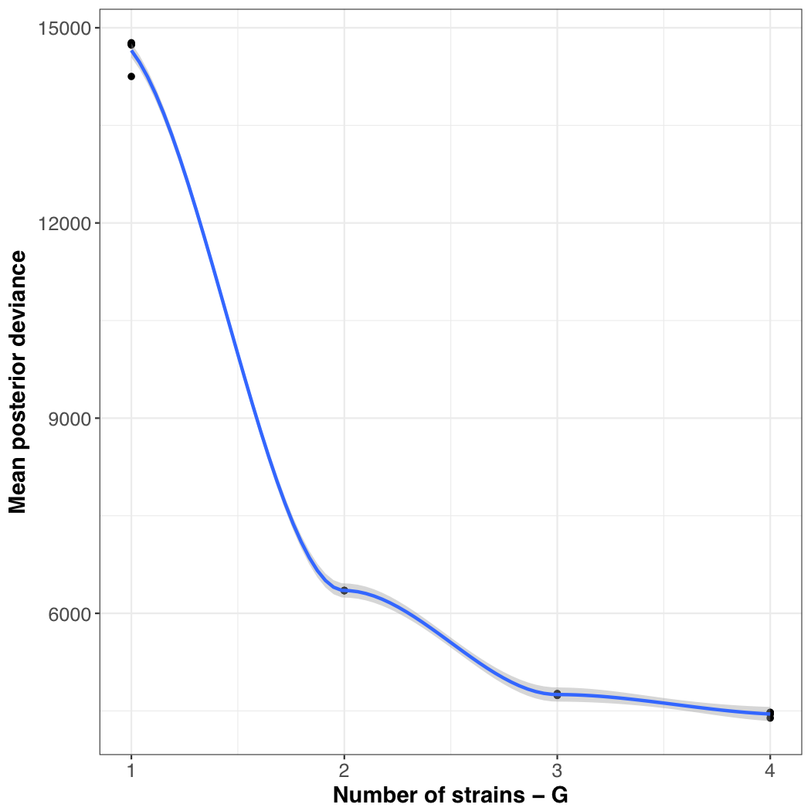
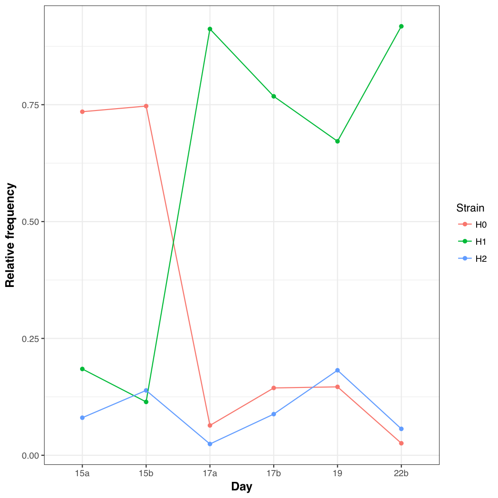

# Strain Resolution

## Run the DESMAN pipeline to resolve strains in each high quality bin

Select clusters which are sufficiently good and have enough coverage > 50 for strain resolution.
```
cd ~/Projects/InfantGut
python3 ~/repos/Ebame5/scripts/CompleteClustersCov.py Concoct/clustering_gt1000_scg.tsv Concoct/clustering_gt1000_cov.csv > Split/Comp50.txt
```

There will only be two:
```
more Split/Comp50.txt
```


### Getting core variant frequencies

Then we select the SCGS for each cluster:
```bash
cd ~/Projects/InfantGut

cp ~/repos/MAGAnalysis/cogs.txt scgs.txt 
while read -r cluster 
do
    echo $cluster
    $DESMAN/scripts/SelectContigsPos.pl scgs.txt < Split/${cluster}/${cluster}.cog > Split/${cluster}/${cluster}_core.cogs
done < Split/Comp50.txt
```

The first step in pre-processing for DESMAN would be to split up the bam files by each cluster in turn:

```
cd Annotate
python ~/bin/Lengths.py -i final_contigs_gt1000_c10K.fa > final_contigs_gt1000_c10K.len
cd ..
```

Then split mapping files:
```
mkdir SplitBam

while read -r cluster 
do
    grep ">" Split/${cluster}/${cluster}.fa | sed 's/>//g' > Split/${cluster}/${cluster}_contigs.txt
    AddLengths.pl Annotate/final_contigs_gt1000_c10K.len < Split/${cluster}/${cluster}_contigs.txt > Split/${cluster}/${cluster}_contigs.tsv
    mkdir SplitBam/${cluster}
    echo $cluster
    for bamfile in Map/*.mapped.sorted.bam
    do
        stub=${bamfile#Map\/}
        stub=${stub%.mapped.sorted.bam}
        echo $stub
        samtools view -bhL Split/${cluster}/${cluster}_contigs.tsv $bamfile > SplitBam/${cluster}/${stub}_Filter.bam&

    done 
        
done < Split/Comp50.txt 
```


and use a third party program bam-readcount to get base frequencies at each position on each contig:

```
while read line
do
    mag=$line

    echo $mag

    cd SplitBam
    cd ${mag}

    cp ../../Split/${mag}/${mag}_contigs.tsv ${mag}_contigs.tsv
    samtools faidx ../../Split/${mag}/${mag}.fa

    echo "${mag}_contigs.tsv"
    mkdir ReadcountFilter
    for bamfile in *_Filter.bam
    do
        stub=${bamfile%_Filter.bam}
            
        echo $stub

        (samtools index $bamfile; bam-readcount -w 1 -q 20 -l "${mag}_contigs.tsv" -f ../../Split/${mag}/${mag}.fa $bamfile 2> ReadcountFilter/${stub}.err > ReadcountFilter/${stub}.cnt)&
    
     done
     cd ..
     cd ..
     
done < Split/Comp50.txt

``` 


Then we can get the base counts on the core cogs:

```

mkdir Variants
while read -r cluster 
do
    echo $cluster
    (cd ./SplitBam/${cluster}/ReadcountFilter; gzip *cnt; cd ../../..; python $DESMAN/scripts/ExtractCountFreqGenes.py Split/${cluster}/${cluster}_core.cogs ./SplitBam/${cluster}/ReadcountFilter --output_file Variants/${cluster}_scg.freq > Variants/${cluster}log.txt)&

done < Split/Comp50.txt
``` 

The directory contains 2 .freq files one for each cluster. If we look at one:
```bash
head -n 10 Variants/Cluster14_scg.freq 
```
We see it comprises a header, plus one line for each core gene position, giving base frequencies in the order A,C,G,T. This is the input required by DESMAN.

### Detecting variants on core genes

First we detect variants on both clusters that were identified as 75% pure and complete and had a coverage of greater than 100:

```bash

cd ~/Projects/InfantGut/

mkdir SCG_Analysis

for file in ./Variants/*freq
do
    echo $file

    stub=${file%.freq}
    stub=${stub#./Variants\/}

    echo $stub

    mkdir SCG_Analysis/$stub
    
    cp $file SCG_Analysis/$stub
    cd SCG_Analysis/$stub    

    Variant_Filter.py ${stub}.freq -o $stub -p
    
    cd ../..
done

```

The Variant_Filter.py script produces an output file ${stub}sel_var.csv which lists those positions that are identified as variants by the log-ratio test with FDR < 1.0e-3. We can compare variant frequencies in the two clusters:

```bash
cd SCG_Analysis
wc */*sel_var.csv
```

We can also go into the Cluster 14 directory and look at the output files:
```bash
cd Cluster14_scg
more Cluster14_scgsel_var.csv 
```

The other important file is:
```bash
more Cluster14_scgtran_df.csv
```

This is an estimate of base error rates which is used as a starting point for the haplotype inference.


### Inferring haplotypes

So accounting for the header line we observe 9 and 214 variants in Clusters 14 and 18 respectively. For Cluster 18 then can we attempt to resolve haplotypes. Using the desman executable:

```
cd Cluster18_scg

varFile='Cluster18_scgsel_var.csv'

eFile='Cluster18_scgtran_df.csv'
    
for g in 1 2 3 4  
do
    echo $g
    for r in 0 1 2 3 4
    do
	    echo $r
        (desman $varFile -e $eFile -o Cluster18_${g}_${r} -g $g -s $r -m 1.0 -i 100)& 
    done
    wait
done
```

Now lets look at the posterior deviance:
```
cat */fit.txt | cut -d"," -f2- > Dev.csv
sed -i '1iH,G,LP,Dev' Dev.csv 
```

Which we can then visualise:
```
$DESMAN/scripts/PlotDev.R -l Dev.csv -o Dev.pdf
```



There are two or possibly three haplotypes. We can also run the heuristic to determine haplotype number:

```bash
python $DESMAN/scripts/resolvenhap.py Cluster18
```

This should output:
```
3,3,0,0.0284267912773,Cluster18_3_0/Filtered_Tau_star.csv
```

This has the format:
```
No of haplotypes in best fit, No. of good haplotypes in best fit, Index of best fit, Average error rate, File with base predictions
```

Have a look at the prediction file:
```
more Cluster18_3_0/Filtered_Tau_star.csv
```

The position encoding is ACGT so what are the base predictions at each variant position? 
We can turn these into actual sequences with the following commands:

```bash

    cut -d"," -f 1 < Cluster18_scgsel_var.csv | sort | uniq | sed '1d' > coregenes.txt

    mkdir SCG_Fasta_3_0
    
    python3 $DESMAN/scripts/GetVariantsCore.py ../../Annotate/final_contigs_gt1000_c10K.fa ../..//Split/Cluster18/Cluster18_core.cogs Cluster18_3_0/Filtered_Tau_star.csv coregenes.txt -o SCG_Fasta_3_0/
```

This generates one fasta sequence file for each gene with the two strains in:

```bash
ls SCG_Fasta_3_0
```


```bash
python3 $DESMAN/scripts/validateSNP2.py Cluster18_3_0/Filtered_Tau_star.csv Cluster18_3_0/Filtered_Tau_star.csv
``` 


This gives distance matrices between the true variants and the predictions in terms of SNV and fractions:
```bash
Intersection: 214
[[  0  89 157]
 [ 89   0 183]
 [157 183   0]]
[[ 0.          0.41588785  0.73364486]
 [ 0.41588785  0.          0.85514019]
 [ 0.73364486  0.85514019  0.        ]]
```

Now look at time series of strain abundance:

```
cp ~/repos/PenrynTutorial/TimeStrain.R .
Rscript TimeStrain.R -g Cluster18_3_0/Gamma_starR.csv -m ~/Data/InfantGut/sharon_mappingR.txt 
```



Then for Cluster14
```
cd ..
cd Cluster14_scg

varFile='Cluster14_scgsel_var.csv'

eFile='Cluster14_scgtran_df.csv'
    
for g in 1 2 3 4  
do
    echo $g
    for r in 0 1 2 3 4
    do
	    echo $r
        (desman $varFile -e $eFile -o Cluster14_${g}_${r} -g $g -s $r -m 1.0 -i 100)& 
    done
    wait
done
```

Are any subpopulations found?


### Accessory Gene assignment

The next step would be to calculate the accessory gene presence and absences for these strains. 

```
cd ~/Projects/InfantGut/

mkdir AllFreq

```

Then we get frequencies but now for all genes:

```
python3 $DESMAN/scripts/ExtractCountFreqGenes.py -g Split/Cluster18/Cluster18.genes ./SplitBam/Cluster18/ReadcountFilter --output_file AllFreq/Cluster18.freq

```

and find variants on those genes:

```
cd AllFreq
Variant_Filter.py Cluster18.freq -o Cluster18
```

How many variants do we find on the accessory genome?

We also need gene coverages these we compute from the frequencies:

```
python3 $DESMAN/scripts/CalcGeneCov.py Cluster18.freq > Cluster18_gene_cov.csv
```

```
cut -d"," -f5 ../Split/Cluster18/Cluster18_core.cogs > Cluster18_core_genes.txt
```

Calculate coverage on core genes:

```
python3 $DESMAN/scripts/CalcDelta.py Cluster18_gene_cov.csv Cluster18_core_genes.txt Cluster18_core
```

Now lets link the best run from DESMAN for convenience:

```
ln -s ../SCG_Analysis/Cluster18_scg/Cluster18_3_0 .
```

and finally:

```
python3 $DESMAN/desman/GeneAssign.py Cluster18_coremean_sd_df.csv Cluster18_3_0/Gamma_star.csv Cluster18_gene_cov.csv Cluster18_3_0/Eta_star.csv -m 20 -v Cluster18sel_var.csv -o Cluster18 --assign_tau
```

And look at gene and SNP divergence:
```
python ~/repos/PenrynTutorial/IdentEtaGamma.py Cluster18 Cluster18etaS_df.csv Cluster18_3_0/Selected_variants.csv Cluster18_3_0/Filtered_Tau_starR.csv Cluster18_3_0/Gamma_starR.csv
```